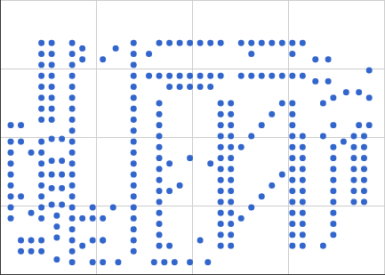
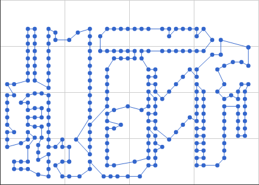

## Traveling Salesman Problem (TSP)

##### Kamal Bentahar

@snap[south]
@size[0.3em](Based on https://developers.google.com/optimization/routing/tsp and https://en.wikipedia.org/wiki/Travelling_salesman_problem)
@snapend

---


Shortest tour?

+++


4+2+5+3 = 14

+++


3+1+2+1 = 7

+++


+++



+++



---

- One of the most famous problems in CS.
- Given a **list of cities** and the **distances between each pair of cities**, what is the shortest possible route that visits each city and returns to the origin city?
- **NP-hard problem**!

---

## Model
- Weighted graph:
    - Nodes: cities
    - Edges: direct routes between cities.
    - Edge weights: distance between cities.
- Goal: find the path with the shortest sum of weights.

+++

### Exhaustive search
- Search all possible paths.
- Guaranteed to find the shortest...
- ... but is computationally intractable for all but small sets of locations.

+++

## What is the issue?

- Finding the shortest path for 20 cities is much more than twice as hard as 10 cities.

@size[0.5em](
| Number of cities n | Number of paths (n-1)!/2 |
| ------------ | ------------- |
|3|1|
|4|3|
|5|12|
|6|60|
|7|360|
|8|2 520|
|9|20,160|
|10|181,440|
|15|43,589,145,600|
|20|6.082 × 1016|
|71|5.989 × 1099|
)

+++


---

## Google OR-Tools

+++

```python
  # Cities
  city_names = ["New York", "Los Angeles", "Chicago", "Minneapolis", "Denver", "Dallas", "Seattle",
                "Boston", "San Francisco", "St. Louis", "Houston", "Phoenix", "Salt Lake City"]
  # Distance matrix
  dist_matrix = [
    [   0, 2451,  713, 1018, 1631, 1374, 2408,  213, 2571,  875, 1420, 2145, 1972], # New York
    [2451,    0, 1745, 1524,  831, 1240,  959, 2596,  403, 1589, 1374,  357,  579], # Los Angeles
    [ 713, 1745,    0,  355,  920,  803, 1737,  851, 1858,  262,  940, 1453, 1260], # Chicago
    [1018, 1524,  355,    0,  700,  862, 1395, 1123, 1584,  466, 1056, 1280,  987], # Minneapolis
    [1631,  831,  920,  700,    0,  663, 1021, 1769,  949,  796,  879,  586,  371], # Denver
    [1374, 1240,  803,  862,  663,    0, 1681, 1551, 1765,  547,  225,  887,  999], # Dallas
    [2408,  959, 1737, 1395, 1021, 1681,    0, 2493,  678, 1724, 1891, 1114,  701], # Seattle
    [ 213, 2596,  851, 1123, 1769, 1551, 2493,    0, 2699, 1038, 1605, 2300, 2099], # Boston
    [2571,  403, 1858, 1584,  949, 1765,  678, 2699,    0, 1744, 1645,  653,  600], # San Francisco
    [ 875, 1589,  262,  466,  796,  547, 1724, 1038, 1744,    0,  679, 1272, 1162], # St. Louis
    [1420, 1374,  940, 1056,  879,  225, 1891, 1605, 1645,  679,    0, 1017, 1200], # Houston
    [2145,  357, 1453, 1280,  586,  887, 1114, 2300,  653, 1272, 1017,    0,  504], # Phoenix
    [1972,  579, 1260,  987,  371,  999,  701, 2099,  600, 1162,  1200,  504,   0]] # Salt Lake City
```

@[1-3]
@[4-18]

---

## Computing a solution
The traditional lines of attack for the NP-hard problems:

- Devising exact algorithms, which work reasonably fast only for small problem sizes.
- Devising "suboptimal" or heuristic algorithms
    - i.e., algorithms that deliver either seemingly or probably good solutions, but which could not be proved to be optimal.
- Finding special cases for the problem for which either better or exact heuristics are possible.

+++

## Exact algorithms
- Try all permutations (using brute force search).
- Running time: within a polynomial factor of ${\displaystyle O(n!)}$


+++

- Dynamic programming: Held–Karp algorithm, ${\displaystyle O(n^{2}2^{n})}$.

+++

- Improving these time bounds seems to be difficult.
- For example, it has not been determined whether an exact algorithm for TSP that runs in time $\displaystyle O(1.9999^{n})$ exists!

+++

### Other approaches include:

- Various branch-and-bound algorithms -- TSPs containing 40–60 cities.
- Progressive improvement algorithms -- up to 200 cities.
- Branch-and-bound and problem-specific cut generation --  current record, instance with 85,900 cities.


---

## Heuristic and approximation algorithms

Modern methods can find solutions for millions of cities within a reasonable time which are with a high probability just 2–3% away from the optimal solution.


+++

### Constructive heuristics - greedy algorithm

- Nearest neighbour (NN) algorithm lets the salesman choose the nearest unvisited city as his next move.


---

## Iterative improvement

+++

### Pairwise exchange
- The pairwise exchange or 2-opt technique involves iteratively removing two edges and replacing these with two different edges that reconnect the fragments created by edge removal into a new and shorter tour.

+++

### Ant colony optimization


