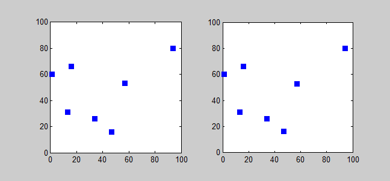

## Traveling Salesman Problem

Based on https://developers.google.com/optimization/routing/tsp and https://en.wikipedia.org/wiki/Travelling_salesman_problem

---


+++


+++


+++


+++

---?video=https://www.youtube.com/embed/XBTiQ6IvgmM

---

The Traveling Salesman Problem (TSP) is one of the most famous problems in computer science. In what follows, we'll describe the problem and show you how to find a solution.

+++

The travelling salesman problem (TSP) asks the following question: "Given a list of cities and the distances between each pair of cities, what is the shortest possible route that visits each city and returns to the origin city?" It is an NP-hard problem in combinatorial optimization, important in operations research and theoretical computer science.

---

## The problem

Back in the days when salesmen traveled door-to-door hawking vacuums and encyclopedias, they had to plan their routes, from house to house or city to city. The shorter the route, the better. Finding the shortest route that visits a set of locations is an exponentially difficult problem: finding the shortest path for 20 cities is much more than twice as hard as 10 cities.

+++

An exhaustive search of all possible paths would be guaranteed to find the shortest, but is computationally intractable for all but small sets of locations. For larger problems, optimization techniques are needed to intelligently search the solution space and find near-optimal solutions.

+++

Mathematically, traveling salesman problems can be represented as a graph, where the locations are the nodes and the edges (or arcs) represent direct routes between the nodes. The weight of each edge is the distance between the nodes. The goal is to find the path with the shortest sum of weights. Below, we see a simple four-node graph and the shortest cycle that visits every node: 

+++

In addition to finding solutions to the classical Traveling Salesman Problem, OR-Tools also provides methods for more general types of TSPs, including the following:

+++

Asymmetric cost problems—The traditional TSP is symmetric: the distance from point A to point B equals the distance from point B to point A. However, the cost of shipping items from point A to point B might not equal the cost of shipping them from point B to point A. OR-Tools can also handle problems that have asymmetric costs.
Prize-collecting TSPs, where benefits accrue from visiting nodes
TSP with time windows

---

```python
  # Cities
  city_names = ["New York", "Los Angeles", "Chicago", "Minneapolis", "Denver", "Dallas", "Seattle",
                "Boston", "San Francisco", "St. Louis", "Houston", "Phoenix", "Salt Lake City"]
  # Distance matrix
  dist_matrix = [
    [   0, 2451,  713, 1018, 1631, 1374, 2408,  213, 2571,  875, 1420, 2145, 1972], # New York
    [2451,    0, 1745, 1524,  831, 1240,  959, 2596,  403, 1589, 1374,  357,  579], # Los Angeles
    [ 713, 1745,    0,  355,  920,  803, 1737,  851, 1858,  262,  940, 1453, 1260], # Chicago
    [1018, 1524,  355,    0,  700,  862, 1395, 1123, 1584,  466, 1056, 1280,  987], # Minneapolis
    [1631,  831,  920,  700,    0,  663, 1021, 1769,  949,  796,  879,  586,  371], # Denver
    [1374, 1240,  803,  862,  663,    0, 1681, 1551, 1765,  547,  225,  887,  999], # Dallas
    [2408,  959, 1737, 1395, 1021, 1681,    0, 2493,  678, 1724, 1891, 1114,  701], # Seattle
    [ 213, 2596,  851, 1123, 1769, 1551, 2493,    0, 2699, 1038, 1605, 2300, 2099], # Boston
    [2571,  403, 1858, 1584,  949, 1765,  678, 2699,    0, 1744, 1645,  653,  600], # San Francisco
    [ 875, 1589,  262,  466,  796,  547, 1724, 1038, 1744,    0,  679, 1272, 1162], # St. Louis
    [1420, 1374,  940, 1056,  879,  225, 1891, 1605, 1645,  679,    0, 1017, 1200], # Houston
    [2145,  357, 1453, 1280,  586,  887, 1114, 2300,  653, 1272, 1017,    0,  504], # Phoenix
    [1972,  579, 1260,  987,  371,  999,  701, 2099,  600, 1162,  1200,  504,   0]] # Salt Lake City
```

@[1-3]
@[4-18]

---

## Benchmarks

For benchmarking of TSP algorithms, TSPLIB is a library of sample instances of the TSP and related problems is maintained, see the TSPLIB external reference. Many of them are lists of actual cities and layouts of actual printed circuits.

---

## Computing a solution
The traditional lines of attack for the NP-hard problems are the following:

Devising exact algorithms, which work reasonably fast only for small problem sizes.
Devising "suboptimal" or heuristic algorithms, i.e., algorithms that deliver either seemingly or probably good solutions, but which could not be proved to be optimal.
Finding special cases for the problem ("subproblems") for which either better or exact heuristics are possible.

+++

## Exact algorithms
The most direct solution would be to try all permutations (ordered combinations) and see which one is cheapest (using brute force search). The running time for this approach lies within a polynomial factor of {\displaystyle O(n!)} O(n!), the factorial of the number of cities, so this solution becomes impractical even for only 20 cities.


One of the earliest applications of dynamic programming is the Held–Karp algorithm that solves the problem in time {\displaystyle O(n^{2}2^{n})} O(n^{2}2^{n}).

+++

Improving these time bounds seems to be difficult. For example, it has not been determined whether an exact algorithm for TSP that runs in time {\displaystyle O(1.9999^{n})} O(1.9999^{n}) exists.

+++

### Other approaches include:

- Various branch-and-bound algorithms, which can be used to process TSPs containing 40–60 cities.
- Progressive improvement algorithms which use techniques reminiscent of linear programming. Works well for up to 200 cities.
- Implementations of branch-and-bound and problem-specific cut generation (branch-and-cut); this is the method of choice for solving large instances. This approach holds the current record, solving an instance with 85,900 cities, see Applegate et al. (2006).



---

## Heuristic and approximation algorithms
Various heuristics and approximation algorithms, which quickly yield good solutions have been devised. Modern methods can find solutions for extremely large problems (millions of cities) within a reasonable time which are with a high probability just 2–3% away from the optimal solution.

Several categories of heuristics are recognized.

+++

### Constructive heuristics

The nearest neighbour (NN) algorithm (a greedy algorithm) lets the salesman choose the nearest unvisited city as his next move. This algorithm quickly yields an effectively short route. For N cities randomly distributed on a plane, the algorithm on average yields a path 25% longer than the shortest possible path.[18] However, there exist many specially arranged city distributions which make the NN algorithm give the worst route.


+++

### Christofides' algorithm for the TSP
The Christofides algorithm follows a similar outline but combines the minimum spanning tree with a solution of another problem, minimum-weight perfect matching. This gives a TSP tour which is at most 1.5 times the optimal. 

---

## Iterative improvement

+++

### Pairwise exchange
The pairwise exchange or 2-opt technique involves iteratively removing two edges and replacing these with two different edges that reconnect the fragments created by edge removal into a new and shorter tour. Similarly, the 3-opt technique removes 3 edges and reconnects them to form a shorter tour. These are special cases of the k-opt method. Note that the label Lin–Kernighan is an often heard misnomer for 2-opt. Lin–Kernighan is actually the more general k-opt method.

For Euclidean instances, 2-opt heuristics give on average solutions that are about 5% better than Christofides' algorithm. If we start with an initial solution made with a greedy algorithm, the average number of moves greatly decreases again and is {\displaystyle O(n)} O(n). For random starts however, the average number of moves is {\displaystyle O(n\log(n))} {\displaystyle O(n\log(n))}. However whilst in order this is a small increase in size, the initial number of moves for small problems is 10 times as big for a random start compared to one made from a greedy heuristic. This is because such 2-opt heuristics exploit 'bad' parts of a solution such as crossings. These types of heuristics are often used within Vehicle routing problem heuristics to reoptimize route solutions.

+++

### k-opt heuristic, or Lin–Kernighan heuristics

Take a given tour and delete k mutually disjoint edges. Reassemble the remaining fragments into a tour, leaving no disjoint subtours (that is, don't connect a fragment's endpoints together). This in effect simplifies the TSP under consideration into a much simpler problem. Each fragment endpoint can be connected to 2k − 2 other possibilities: of 2k total fragment endpoints available, the two endpoints of the fragment under consideration are disallowed. Such a constrained 2k-city TSP can then be solved with brute force methods to find the least-cost recombination of the original fragments. The k-opt technique is a special case of the V-opt or variable-opt technique. The most popular of the k-opt methods are 3-opt, and these were introduced by Shen Lin of Bell Labs in 1965. There is a special case of 3-opt where the edges are not disjoint (two of the edges are adjacent to one another). In practice, it is often possible to achieve substantial improvement over 2-opt without the combinatorial cost of the general 3-opt by restricting the 3-changes to this special subset where two of the removed edges are adjacent. This so-called two-and-a-half-opt typically falls roughly midway between 2-opt and 3-opt, both in terms of the quality of tours achieved and the time required to achieve those tours.

+++

### V-opt heuristic
The variable-opt method is related to, and a generalization of the k-opt method. Whereas the k-opt methods remove a fixed number (k) of edges from the original tour, the variable-opt methods do not fix the size of the edge set to remove. Instead they grow the set as the search process continues. The best known method in this family is the Lin–Kernighan method (mentioned above as a misnomer for 2-opt). Shen Lin and Brian Kernighan first published their method in 1972, and it was the most reliable heuristic for solving travelling salesman problems for nearly two decades. More advanced variable-opt methods were developed at Bell Labs in the late 1980s by David Johnson and his research team. These methods (sometimes called Lin–Kernighan–Johnson) build on the Lin–Kernighan method, adding ideas from tabu search and evolutionary computing. The basic Lin–Kernighan technique gives results that are guaranteed to be at least 3-opt. The Lin–Kernighan–Johnson methods compute a Lin–Kernighan tour, and then perturb the tour by what has been described as a mutation that removes at least four edges and reconnecting the tour in a different way, then V-opting the new tour. The mutation is often enough to move the tour from the local minimum identified by Lin–Kernighan. V-opt methods are widely considered the most powerful heuristics for the problem, and are able to address special cases, such as the Hamilton Cycle Problem and other non-metric TSPs that other heuristics fail on. For many years Lin–Kernighan–Johnson had identified optimal solutions for all TSPs where an optimal solution was known and had identified the best known solutions for all other TSPs on which the method had been tried.

+++

### Randomized improvement
Optimized Markov chain algorithms which use local searching heuristic sub-algorithms can find a route extremely close to the optimal route for 700 to 800 cities.

TSP is a touchstone for many general heuristics devised for combinatorial optimization such as genetic algorithms, simulated annealing, tabu search, ant colony optimization, river formation dynamics (see swarm intelligence) and the cross entropy method.

+++

### Ant colony optimization
Main article: Ant colony optimization algorithms
Artificial intelligence researcher Marco Dorigo described in 1993 a method of heuristically generating "good solutions" to the TSP using a simulation of an ant colony called ACS (ant colony system).[24] It models behaviour observed in real ants to find short paths between food sources and their nest, an emergent behaviour resulting from each ant's preference to follow trail pheromones deposited by other ants.

ACS sends out a large number of virtual ant agents to explore many possible routes on the map. Each ant probabilistically chooses the next city to visit based on a heuristic combining the distance to the city and the amount of virtual pheromone deposited on the edge to the city. The ants explore, depositing pheromone on each edge that they cross, until they have all completed a tour. At this point the ant which completed the shortest tour deposits virtual pheromone along its complete tour route (global trail updating). The amount of pheromone deposited is inversely proportional to the tour length: the shorter the tour, the more it deposits.


---

## Special cases of the TSP

+++

## Metric TSP
In the metric TSP, also known as delta-TSP or Δ-TSP, the intercity distances satisfy the triangle inequality.

A very natural restriction of the TSP is to require that the distances between cities form a metric to satisfy the triangle inequality; that is the direct connection from A to B is never farther than the route via intermediate C:

{\displaystyle d_{AB}\leq d_{AC}+d_{CB}} d_{AB}\leq d_{AC}+d_{CB}.
The edge spans then build a metric on the set of vertices. When the cities are viewed as points in the plane, many natural distance functions are metrics, and so many natural instances of TSP satisfy this constraint.

The following are some examples of metric TSPs for various metrics.

In the Euclidean TSP (see below) the distance between two cities is the Euclidean distance between the corresponding points.
In the rectilinear TSP the distance between two cities is the sum of the absolute values of the differences of their x- and y-coordinates. This metric is often called the Manhattan distance or city-block metric.
In the maximum metric, the distance between two points is the maximum of the absolute values of differences of their x- and y-coordinates.
The last two metrics appear, for example, in routing a machine that drills a given set of holes in a printed circuit board. The Manhattan metric corresponds to a machine that adjusts first one co-ordinate, and then the other, so the time to move to a new point is the sum of both movements. The maximum metric corresponds to a machine that adjusts both co-ordinates simultaneously, so the time to move to a new point is the slower of the two movements.

In its definition, the TSP does not allow cities to be visited twice, but many applications do not need this constraint. In such cases, a symmetric, non-metric instance can be reduced to a metric one. This replaces the original graph with a complete graph in which the inter-city distance {\displaystyle d_{AB}} d_{AB} is replaced by the shortest path between A and B in the original graph.

+++

### Euclidean TSP
When the input numbers can be arbitrary real numbers, Euclidean TSP is a particular case of metric TSP, since distances in a plane obey the triangle inequality. When the input numbers must be integers, comparing lengths of tours involves comparing sums of square-roots.

Like the general TSP, Euclidean TSP is NP-hard in either case. With rational coordinates and discretized metric (distances rounded up to an integer), the problem is NP-complete.[25] With rational coordinates and the actual Euclidean metric, Euclidean TSP is known to be in the Counting Hierarchy,[26] a subclass of PSPACE. With arbitrary real coordinates, Euclidean TSP cannot be in such classes, since there are uncountably many possible inputs. However, Euclidean TSP is probably the easiest version for approximation.[27] For example, the minimum spanning tree of the graph associated with an instance of the Euclidean TSP is a Euclidean minimum spanning tree, and so can be computed in expected O (n log n) time for n points (considerably less than the number of edges). This enables the simple 2-approximation algorithm for TSP with triangle inequality above to operate more quickly.

In general, for any c > 0, where d is the number of dimensions in the Euclidean space, there is a polynomial-time algorithm that finds a tour of length at most (1 + 1/c) times the optimal for geometric instances of TSP in

{\displaystyle O\left(n(\log n)^{(O(c{\sqrt {d}}))^{d-1}}\right),} O\left(n(\log n)^{(O(c{\sqrt {d}}))^{d-1}}\right),
time; this is called a polynomial-time approximation scheme (PTAS).[28] Sanjeev Arora and Joseph S. B. Mitchell were awarded the Gödel Prize in 2010 for their concurrent discovery of a PTAS for the Euclidean TSP.

In practice, simpler heuristics with weaker guarantees continue to be used.

---

## Computational complexity

The problem has been shown to be NP-hard (more precisely, it is complete for the complexity class FPNP; see function problem), and the decision problem version ("given the costs and a number x, decide whether there is a round-trip route cheaper than x") is NP-complete. The bottleneck traveling salesman problem is also NP-hard. The problem remains NP-hard even for the case when the cities are in the plane with Euclidean distances, as well as in a number of other restrictive cases. Removing the condition of visiting each city "only once" does not remove the NP-hardness, since it is easily seen that in the planar case there is an optimal tour that visits each city only once (otherwise, by the triangle inequality, a shortcut that skips a repeated visit would not increase the tour length).

+++

## Complexity of approximation
In the general case, finding a shortest travelling salesman tour is NPO-complete.[38] If the distance measure is a metric (and thus symmetric), the problem becomes APX-complete[39] and Christofides’s algorithm approximates it within 1.5.[40] The best known inapproximability bound is 123/122 .[41]

If the distances are restricted to 1 and 2 (but still are a metric) the approximation ratio becomes 8/7.[42] In the asymmetric case with triangle inequality, only logarithmic performance guarantees are known, the best current algorithm achieves performance ratio 0.814 log(n);[43] it is an open question if a constant factor approximation exists. The best known inapproximability bound is 75/74 .[41]

The corresponding maximization problem of finding the longest travelling salesman tour is approximable within 63/38.[44] If the distance function is symmetric, the longest tour can be approximated within 4/3 by a deterministic algorithm[45] and within {\displaystyle {\tfrac {1}{25}}(33+\varepsilon )} {\tfrac {1}{25}}(33+\varepsilon ) by a randomized algorithm.[46]


